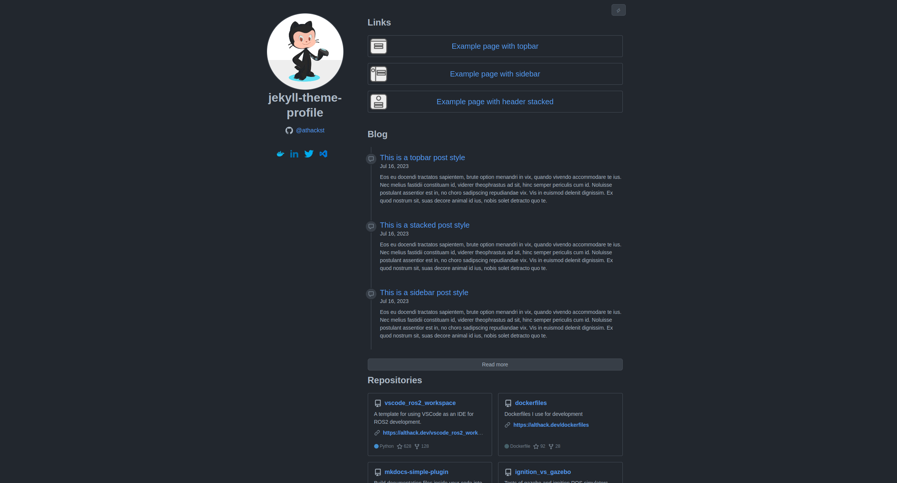

The **sidebar** style modifies the theme's header section to provide a clean, GitHub-like navigation experience.  It features

- A collapsable side navigation bar that collapses 
- Consistent spacing and typography matching GitHub's Primer style
- Dark and light mode compatibility

## Usage

You can use this style as a default for your website, or set the style of an individual page.

### Setting as the default style

Modify the `_config.yml` file to set `sidebar` as the theme's default style

```yml
style: sidebar
```

### Setting the style of a page

To apply the **sidebar** style to a specific page, add the following front matter in your `.md` file

```md
---
style: sidebar
---
```

## Example usage

See examples of an sidebar as a [home](../../sidebar.md), [page](../../page/sidebar.md) and [post](../../_posts/2023-07-16-post-sidebar.md)


